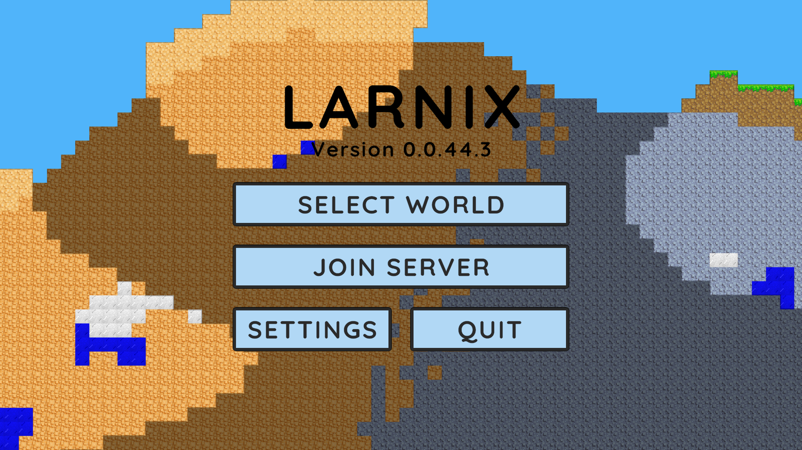
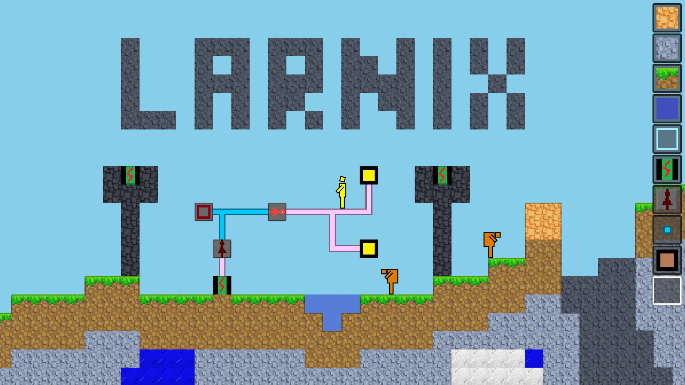
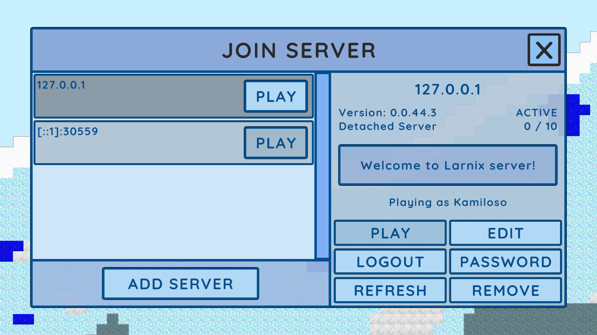
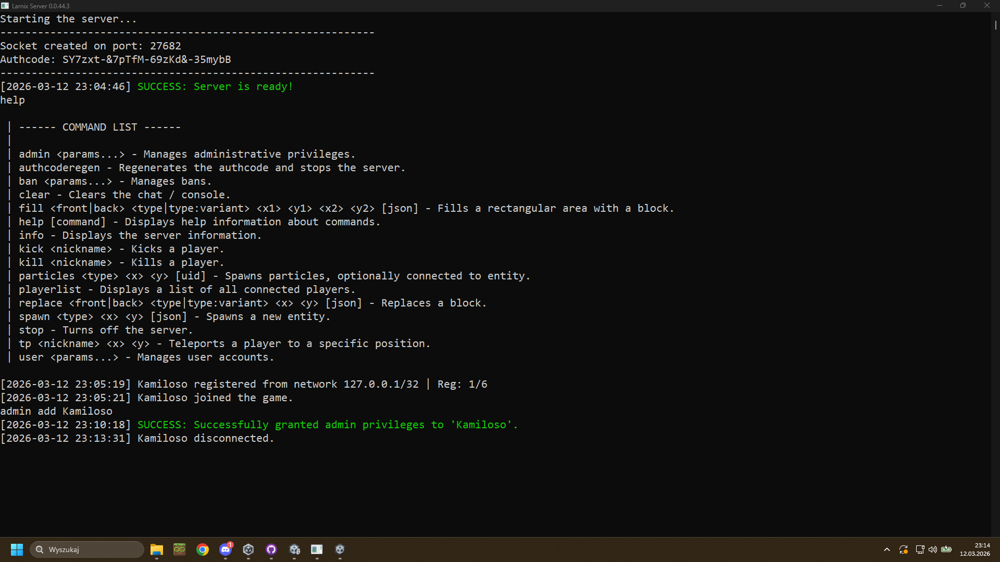

# Larnix

**Larnix** is a multiplayer sandbox game with a procedurally generated world built in **Unity**.

The project uses a **client–server architecture** with a **custom UDP-based networking protocol**, allowing flexible and secure connections between clients and the server.

Although the project is technically made in Unity, **most of the core code has no Unity engine dependencies**. This allows the **server to run as a standalone .NET application** outside the Unity environment.

---

## Features

- 🌍 Procedurally generated world
- 🌐 Custom UDP networking protocol
- 🧠 Client–server architecture
- 🧩 Engine-independent core logic
- 🖥️ Standalone server runnable from raw .NET

---

## Build & Automation

Build automation scripts can be executed **directly from Unity**.

> ⚠️ Note:  
> These scripts currently require a **Windows machine** to run properly.

---

## Project Status

The project is currently in an **early foundation stage**.  
However, the architecture and core systems are already in place, giving it strong potential to become the **most advanced project I've built so far**.

---

## Preview

---

## How to Test

There are **no official builds yet**, but you can compile the project yourself using Unity.

Supported platforms:

- Windows
- Linux
- macOS *(not tested yet)*

### Requirements

- **.NET 8.0**
- **Unity** (version used by the project)

No additional dependencies are required.
